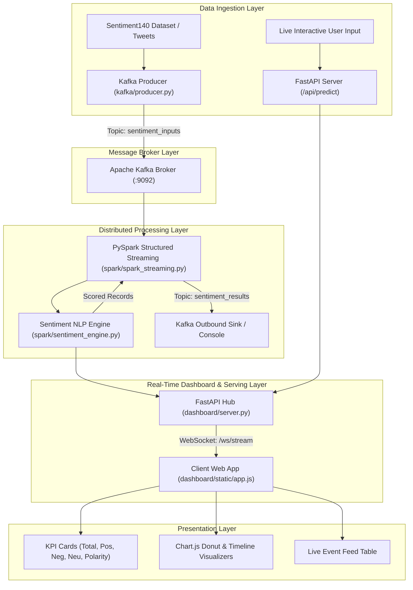

# Real-Time Sentiment Analysis: End-to-End Workflow & Architecture

This document provides a complete overview of the **Real-Time Sentiment Analysis Big Data Pipeline**, detailing the system architecture, component interactions, directory layout, and file-by-file catalog.

---

## 1. System Architecture & Data Flow



---

## 2. Component Workflow Lifecycle

The pipeline operates across 5 stages:

1. **Ingestion & Data Generation**:
   - Live sentences from sample datasets, files (`kafka/tweets.txt`), or web client console inputs are generated with metadata (`id`, `source`, `user`, `timestamp`).
2. **Kafka Event Streaming**:
   - Messages are pushed to the Kafka topic `sentiment_inputs`.
3. **PySpark Structured Streaming & NLP**:
   - Spark continuously consumes the Kafka stream in micro-batches or stream triggers.
   - For every text record, the `sentiment_engine` computes polarity score (-1.0 to +1.0), confidence percentage (0 to 100%), classification (`Positive`, `Negative`, `Neutral`), and extracts key sentiment keywords.
4. **FastAPI & WebSocket Hub**:
   - The dashboard server hosts REST API endpoints for inference and WebSocket streams (`/ws/stream`) for event broadcasting.
5. **Real-Time Frontend Dashboard**:
   - The browser interface dynamically updates KPI cards, donut distribution charts, continuous polarity timeline graphs, keyword frequency tags, and incoming live feeds with sub-second latency.

---

## 3. Detailed File Catalog & Directory Structure

```
RealTimeSentimentAnalysis/
│
├── dashboard/                      # Web Dashboard & Real-Time Visualization Hub
│   ├── server.py                   # FastAPI backend + WebSocket event broadcaster + background stream generator
│   └── static/
│       ├── index.html              # Modern dark-theme glassmorphism UI layout
│       ├── style.css               # Design system, CSS variables, micro-animations, responsive layout
│       └── app.js                  # Frontend WebSocket client, Chart.js managers, live UI updates
│
├── data/                           # Training & Evaluation Datasets
│   ├── training.1600000.processed.noemoticon.csv   # Sentiment140 1.6M record training dataset
│   └── testdata.manual.2009.06.14.csv              # Gold-standard manual testing dataset
│
├── kafka/                          # Ingestion & Streaming Message Broker
│   ├── producer.py                 # Continuous Kafka producer streaming text events with auto-retry
│   └── tweets.txt                  # Sample tweet lines for file-stream simulation
│
├── spark/                          # PySpark Processing & ML Engine
│   ├── sentiment_engine.py         # NLP scoring engine, VADER/Lexicon heuristics, negation handling
│   ├── spark_streaming.py          # PySpark Structured Streaming job connecting Kafka input to output sink
│   ├── train_model.py              # Spark MLlib LogisticRegression model training on HDFS / local data
│   └── load_data.py                # PySpark script to inspect and read HDFS sentiment datasets
│
├── run_pipeline_wsl.sh             # Master startup script for WSL Ubuntu environment
├── test_pipeline.py                # Automated end-to-end verification script for test cases
├── WORKFLOW.md                     # Architecture and workflow documentation
└── README.md                       # Project overview and quick start guide
```

---

## 4. Deep-Dive File Descriptions

### `spark/sentiment_engine.py`
- **Role**: Core sentiment evaluation engine.
- **How it Works**:
  - Tokenizes input text and scans against positive/negative lexicons.
  - Handles intensifiers (*"very"*, *"extremely"*, *"absolutely"*) and negations (*"not"*, *"never"*, *"didn't"*).
  - Computes normalized polarity score between -1.0 (strongly negative) and +1.0 (strongly positive).
  - Assigns confidence percentages and extracts detected sentiment keywords.
- **Key Function**: `analyze_sentiment(text: str) -> dict`

### `spark/spark_streaming.py`
- **Role**: Distributed real-time stream processing job.
- **How it Works**:
  - Connects to Kafka bootstrap server on `sentiment_inputs`.
  - Parses JSON records into Spark SQL DataFrame schema.
  - Applies `analyze_sentiment` as a Spark UDF (`spark_sentiment_udf`).
  - Writes processed stream to Kafka topic `sentiment_results` and stdout Console Sink.

### `spark/train_model.py`
- **Role**: Spark MLlib batch classification trainer.
- **Pipeline Stages**: `Tokenizer` -> `StopWordsRemover` -> `HashingTF` -> `IDF` -> `LogisticRegression`.
- **Outputs**: Evaluates model accuracy on test splits and saves trained pipeline model.

### `dashboard/server.py`
- **Role**: Central communication hub and dashboard API server.
- **Endpoints**:
  - `GET /`: Serves dashboard web application.
  - `POST /api/predict`: Runs immediate sentiment analysis on custom input text.
  - `GET /api/history` & `GET /api/metrics`: Retrieves aggregated metrics and recent event logs.
  - `POST /api/stream/control`: Adjusts streaming generator speed or toggles pause/resume.
  - `POST /api/clear`: Resets historical records and KPI counts.
  - `WebSocket /ws/stream`: Pushes live streaming events and KPI updates to connected web browsers.

### `dashboard/static/index.html`, `style.css`, `app.js`
- **Role**: Client interface providing visual analytics.
- **Features**:
  - Visual Pipeline Architecture status with active node indicators.
  - KPI Metrics (Total processed, Positive %, Negative %, Neutral %, Average Polarity meter).
  - Interactive Live Inference Console for ad-hoc custom testing.
  - Real-time Chart.js donut distribution and rolling polarity timeline charts.
  - Live feed table with sentiment badges and confidence bars.

### `kafka/producer.py`
- **Role**: Data publisher that streams synthetic or file-based reviews to Kafka.
- **Features**: Configurable streaming interval, auto-retry connection handler, and graceful shutdown.

### `test_pipeline.py`
- **Role**: Verification script that runs standard test cases:
  1. *"This movie was fantastic!"* -> Positive
  2. *"I really enjoyed this product."* -> Positive
  3. *"The movie was boring."* -> Negative
  4. *"This was a terrible experience."* -> Negative

---

## 5. Execution Commands

### Run Dashboard Server (WSL)
```bash
source /home/saumya/spark_env/bin/activate
python3 dashboard/server.py
```
Open browser at [http://localhost:8050](http://localhost:8050).

### Run Test Suite
```bash
python3 test_pipeline.py
```

### Run Full Pipeline (WSL)
```bash
bash run_pipeline_wsl.sh
```
